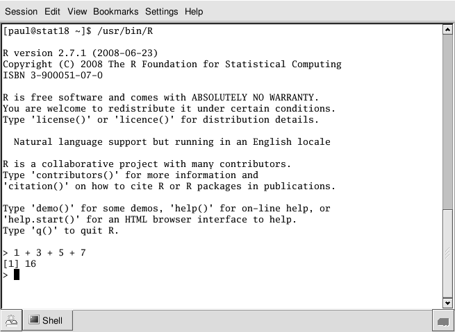

```{r setup, include=FALSE}
options(htmltools.dir.version = FALSE)
knitr::opts_chunk$set(tidy = FALSE, eval = FALSE)
```

class: inverse, center, middle

# Keep in touch

<a href="mailto:sarah.romanes@hotmail.com"><i class="fa fa-paper-plane fa-fw"></i>&nbsp; sarah.romanes@sydney.edu.au</a><br>
<a href="http://twitter.com/sarah_romanes"><i class="fa fa-twitter fa-fw"></i>&nbsp; @sarah_romanes</a><br>
<a href="http://github.com/sarahromanes"><i class="fa fa-github fa-fw"></i>&nbsp; @sarahromanes</a><br>
<a href="http://www.maths.usyd.edu.au"><i class="fa fa-map-marker fa-fw"></i>&nbsp; School of Mathematics and Statistics @ The University of Sydney</a>
---

# About Me

* 3rd year PhD student at the University of Sydney.
* Lectures and tutors first year Statistics (also involves teaching R!)
* My research revolves around developing statistical machine learning methods for high dimensional data.

* My undergrad is a BSc (Adv) degree, in which I majored in Mathematics and Statistics and graduated Hons I (Mathematical Statistics). It was in my first year of uni that I was introduced to R!

---

# Throwback - 2012

My journey with **R** began back in 2012 (nearly 6 years ago!) in first year stats. **R** was introduced as a glorified calculator.



---

class: inverse, center, middle

<iframe src="https://giphy.com/embed/26mfh0x8OswzgxNDO" width="480" height="360" frameBorder="0" class="giphy-embed" allowFullScreen></iframe><p><a href="https://giphy.com/gifs/peteandpete-season-2-episode-6-26mfh0x8OswzgxNDO">via GIPHY</a></p>
---


# A typical first year question

$$\text{Suppose } X \sim \mathcal{N}(0,1). \text{What is } P(X \leq 0.8)? $$

```{r cars, fig.height=3, dev='svg', eval=TRUE, echo=FALSE}
curve(dnorm(x), xlim = c(-2, 2), ylab = "", axes = FALSE)
abline(h = 0)
sequence = seq(-2, 0.8, 0.1)
polygon(x = c(sequence, 0.8, -2), y = c(dnorm(c(sequence)), 0, 0), col = "purple")
axis(1, at = c(-2, -1, 0, 0.8, 1, 2), pos = 0)
```

Answer:

```{r,  eval=TRUE}
pnorm(0.8)
```

---


class: center, middle

# Along came sweave in second year... (2013)


---
# ... with its horrible syntax
```{r, eval=FALSE}
\documentclass{article}

\begin{document}
\SweaveOpts{concordance=TRUE}

\begin{center}
{\large \textbf{ STAT2011 Statistical Models} }\\
{\footnotesize\texttt{sydney.edu.au/science/maths/stat2011}}
\end{center}
\vspace{-1mm}
\begin{tabular*}{1.0\linewidth}{@{\extracolsep{\fill}}lr@{}}
  \hline\noalign{\smallskip}
Semester 1, 2013 & Username: \texttt{\Sexpr{Sys.getenv("USER")}} \\ %Michael Stewart\\
\hline
\end{tabular*}
\begin{center}
 \textbf{Computer Exercise Week 3}\\Due by the end of your week 4 session\\
 \textbf{Last compiled}: \today
\end{center}
```

---

# What I was formally taught during my undergraduate degree in R (2012 - 2015)

`r icon::fa("check", size=2)` Statistical modelling techniques

`r icon::fa("check", size=2)` ... and through that, baseR (by experience).

`r icon::fa("check", size=2)` Basic report making via Sweave implementation

***

**Essentially - a strong focus on Statistics, and less focus on Data Science! R was a means to the end.**


---

# What I was NOT formally taught during my undergraduate degree

`r icon::fa("times", size=2)` tidyverse, eg. `ggplot2`, `dplyr`, `purrr`  packages

`r icon::fa("times", size=2)` rmarkdown/ xaringan slides/ blogdown

`r icon::fa("times", size=2)` advanced R topics such as functions, object orientated programming, good programming practice

`r icon::fa("times", size=2)` package development 

`r icon::fa("times", size=2)` git/ github/ version control

***

**I have had to learn (and not yet master) a lot of these things on my own accord during my PhD.**

---

class: inverse, center, middle

# So, why am I telling you all of this?

---

class: center

## 1) Everyone still has something to learn in R, even if we have been using it for a long time

Especially those of us who learnt R 'formally'! For example, a lot of us are learning the `tidyverse` along side you! If you ask us for how to do things, we might give you a long baseR solution...


---

class: center, middle

## 2) Learning these things takes time and patience, and life does get in the way!

<center>


</center>
---

# My tips on learning R

* My best improvements in R came from having clear motivations for WHY I was learning new skills
  + I learned `ggplot2` to make better data vis for presentations/publications/ packages
  + I learned how to develop packages to complement my research and to also improve workflow
  + I learned `xaringan` to make these slides today!
  + I am *slowly* learning `dplyr` to speed up my data vis steps! (Still hasn't made a way to my modelling yet though... not sure it ever will)

* Learn from examples! Eg, this presentation was based off Apres Hills R Ladies talk about blogdown! Work smart, not hard.

* Having a mentor is extremely useful. I found my coding to improve drastically after my honours year as I had great guidance from an expert (my supervisor).


---

# Short plug - my packages!


---


class: center, middle

# Thanks!

To Yihui and RStudio for the [**blogdown** package](https://cran.r-project.org/web/packages/blogdown/index.html)

To Yihui and Amber for inviting me to be a co-author on the [**blogdown** book](https://bookdown.org/yihui/blogdown/)

To the [`rbind`](https://github.com/rbind) group for awesome support

To the R-Ladies PDX organizers, Augustina and Deeksha, for allowing me to use them as a guinea pig- join the [R-Ladies PDX meetup group](https://www.meetup.com/R-Ladies-PDX/)!

Slides created via the R package [**xaringan**](https://github.com/yihui/xaringan).
